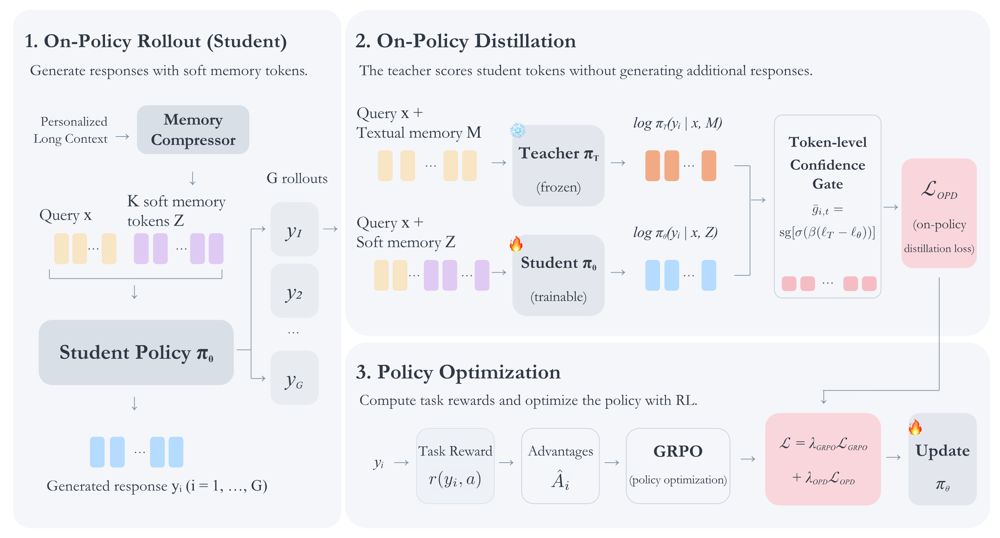
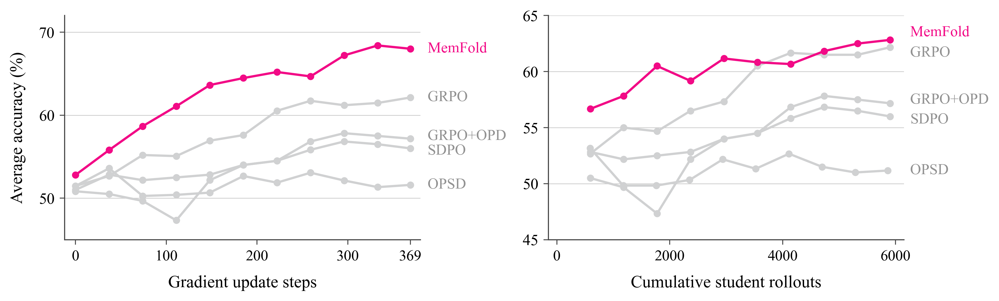
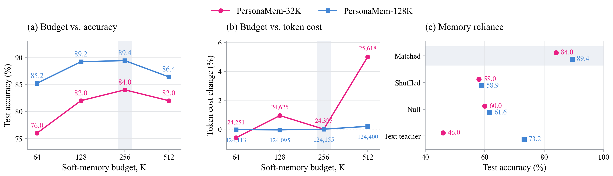
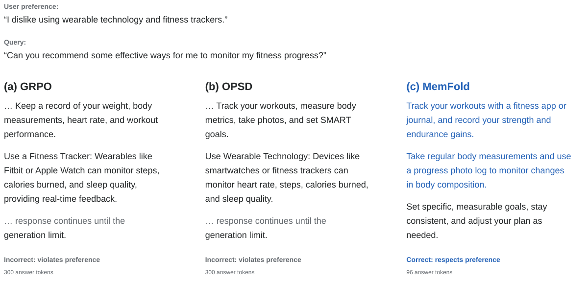

<h1 align="center">
  
  MemFold
</h1>
<h3 align="center">Learning Compact Soft Memory for Long-Context Personalization<br>via On-Policy Optimization</h3>

<p align="center"><b>Compact memory. Personalized answers.</b></p>

<p align="center">
  <a href="https://memfold.github.io/"></a>
  <a href="https://arxiv.org/abs/2609.36435" title="Read the paper on arXiv"></a>
  <a href="https://huggingface.co/Johnny221B/memfold"></a>
  <a href="https://github.com/Johnny221B/memfold"></a>
</p>

<p align="center">
  <a href="#overview">Overview</a> ·
  <a href="#results">Results</a> ·
  <a href="#quick-start">Quick start</a> ·
  <a href="#training-pipeline">Training</a> ·
  <a href="#citation">Citation</a>
</p>

<p align="center">
  Jingxuan Wu<sup>2,*</sup>, Yuzhe Yang<sup>1,*</sup>, Yiqiao Huang<sup>3</sup>, Chengzhi Liu<sup>1</sup>, Qingni Wang<sup>1</sup>,<br>
  Chengxuan Qian<sup>1</sup>, Shutong Wu<sup>4</sup>, Jiawei Zhang<sup>4</sup>, Xin Eric Wang<sup>1</sup><br>
  <sup>1</sup>UC Santa Barbara · <sup>2</sup>UNC Chapel Hill · <sup>3</sup>Harvard University · <sup>4</sup>UW–Madison<br>
  <sup>*</sup>Equal contribution
</p>

## News

- **2026-09-29**: The paper manuscript, code, and model checkpoints are available through the links above. The README now includes results, paper figures, and a checkpoint quick start.

## Overview

**MemFold learns compact memories through the answers they support.** It converts a user's interaction history into textual evidence, compresses that evidence into soft memory vectors, and trains a reader on responses it generates from those vectors. Task rewards and a frozen textual-memory teacher provide complementary feedback on the same student rollouts.

- **A compact reader interface.** PersonaMem experiments use 256 soft memory vectors for both 32K and 128K histories.
- **Training on the reader's own answers.** GRPO rewards successful responses; confidence-gated token supervision guides the same sampled tokens without extra teacher rollouts.
- **Personalization and transfer.** Evaluated with three Qwen backbones on PersonaMem-32K/128K, PrefEval, and LongMemEval.
- **Code and weights.** Memory extraction, compressor pretraining, reader training, evaluation, and baseline implementations are included. Nine selected reader bundles and their memory components are available on [Hugging Face](https://huggingface.co/Johnny221B/memfold).

## How it works

<p align="center">
  
</p>

1. **Build a memory.** A writer extracts useful evidence from the visible interaction history. A Perceiver-style compressor maps the textual memory into continuous vectors.
2. **Initialize the reader.** Supervised training teaches the reader to use the compressed representation to answer queries.
3. **Optimize on-policy.** The student samples responses from soft memory. GRPO supplies outcome-level rewards, while the frozen textual-memory teacher scores the student's tokens through a detached confidence gate. Only the student LoRA is updated during this phase; the teacher and compressor stay frozen.

The teacher is removed at inference. The fixed budget bounds the **reader-side memory input**; building the memory still requires processing the history. The LoCoMo-to-LongMemEval recipe uses a separate session interface: **512 soft tokens per session plus bounded textual memory**, rather than a single 256-token block for the entire history.

## Results

Accuracy (%) reported on the [project page](https://memfold.github.io/#results); higher is better. These are the reported main results, not a new evaluation of this checkout.

| Backbone | PersonaMem-32K | PersonaMem-128K | PrefEval | LongMemEval |
|---|---:|---:|---:|---:|
| Qwen2.5-3B-Instruct | **70.0** | **88.4** | **19.9** | **32.4** |
| Qwen2.5-7B-Instruct | **88.0** | **94.4** | **14.1** | **36.8** |
| Qwen3-4B | **84.0** | **89.4** | **15.2** | **38.6** |

MemFold has the highest reported accuracy across these comparisons, with a tie on Qwen2.5-7B PrefEval. On PersonaMem-128K, its advantage over the best listed baseline is **22.3, 15.9, and 23.7 percentage points** for Qwen2.5-3B, Qwen2.5-7B, and Qwen3-4B, respectively.

PrefEval uses PersonaMem-32K-trained checkpoints; LongMemEval uses LoCoMo-trained checkpoints. Neither transfer setting trains on the target dataset. Main results use greedy decoding; sampled component-ablation results use a different protocol and should not be mixed with this table. “—” denotes no valid outputs in the project's comparison.

<details>
<summary><b>Qwen2.5-3B-Instruct: full comparison</b></summary>

| Method | PersonaMem-32K | PersonaMem-128K | PrefEval | LongMemEval |
|---|---:|---:|---:|---:|
| Full Text | 46.0 | 21.9 | 12.9 | 26.6 |
| xRAG | 36.0 | 55.8 | 8.5 | 10.2 |
| AutoCompressor | 32.0 | 30.5 | — | — |
| MemGen | 54.0 | 66.1 | 13.3 | 3.8 |
| GRPO | 68.0 | 58.4 | 11.3 | 26.0 |
| OPSD | 54.0 | 29.6 | 12.8 | 26.2 |
| **MemFold** | **70.0** | **88.4** | **19.9** | **32.4** |

</details>

<details>
<summary><b>Qwen2.5-7B-Instruct: full comparison</b></summary>

| Method | PersonaMem-32K | PersonaMem-128K | PrefEval | LongMemEval |
|---|---:|---:|---:|---:|
| Full Text | 60.0 | 24.0 | 14.0 | 25.4 |
| xRAG | 62.0 | 64.9 | 10.9 | 12.2 |
| AutoCompressor | 66.0 | 30.7 | — | 9.6 |
| MemGen | 76.0 | 78.5 | 14.1 | 11.0 |
| GRPO | 70.0 | 62.2 | 14.1 | 25.0 |
| OPSD | 64.0 | 47.2 | 13.2 | 25.0 |
| **MemFold** | **88.0** | **94.4** | **14.1** | **36.8** |

</details>

<details>
<summary><b>Qwen3-4B: full comparison</b></summary>

| Method | PersonaMem-32K | PersonaMem-128K | PrefEval | LongMemEval |
|---|---:|---:|---:|---:|
| Full Text | 56.0 | 4.3 | 13.6 | 27.8 |
| xRAG | 66.0 | 65.2 | 2.8 | 6.6 |
| AutoCompressor | 58.0 | 30.8 | — | 14.2 |
| MemGen | 56.0 | 65.7 | 12.3 | 10.4 |
| GRPO | 62.0 | 65.7 | 13.8 | 27.4 |
| OPSD | 74.0 | 39.5 | 13.8 | 26.0 |
| **MemFold** | **84.0** | **89.4** | **15.2** | **38.6** |

</details>
## Training efficiency and memory analysis

<p align="center">
  
</p>

**Learning from shared rollouts.** On PersonaMem-32K with Qwen2.5-3B, MemFold improves accuracy faster per optimizer update and reaches comparable accuracy with fewer student rollouts. These curves compare full recipes with different inputs and initializations. They measure updates and student rollouts, **not wall-clock time**; initialization and teacher forward-pass costs are not included in the rollout count.

<p align="center">
  
</p>

**The memory content matters.** Qwen3-4B peaks at a 256-token budget in the tested recipe. Shuffling or removing its memory sharply reduces accuracy on both PersonaMem settings. Changing the soft-token budget has a comparatively small effect on end-to-end token-equivalent cost because the history-reading pass remains necessary.

<details>
<summary><b>A personalization example: respecting a user's preference</b></summary>

<p align="center">
  
</p>

In this PrefEval example with Qwen3-4B, the user's history implies a dislike of wearable technology. GRPO and OPSD still recommend fitness trackers; MemFold offers compatible alternatives. The displayed preference summarizes the history and is not supplied explicitly to the models. Answer-token counts describe this example only and do not include memory construction or establish a dataset-wide efficiency gain.

</details>

## Quick start

### 1. Install

Use Python 3.11 and a CUDA-compatible PyTorch installation. The training stack used PyTorch 2.8.0; pinned library dependencies are listed in [pyproject.toml](pyproject.toml).

```bash
git clone https://github.com/Johnny221B/memfold.git
cd memfold
pip install -e '.[test]'
# For memory generation with vLLM:
pip install -e '.[inference]'
```

### 2. Download a checkpoint bundle

The [weight repository](https://huggingface.co/Johnny221B/memfold) contains the following selected main-result bundles for **Qwen3-4B, Qwen2.5-3B-Instruct, and Qwen2.5-7B-Instruct**:

| HF directory | Contents |
|---|---|
| `personamem-32k/<backbone>/` | Reader LoRA + 256-token bridge |
| `personamem-128k/<backbone>/` | Reader LoRA + 256-token bridge |
| `locomo/<backbone>/` | Reader LoRA + session compressor + mapper |
| `shared/locomo-writer-qwen3-4b/` | Shared writer used by the released LongMemEval configurations |

Backbone directory names are `qwen3-4b`, `qwen2.5-3b`, and `qwen2.5-7b`. For example:

```python
from huggingface_hub import snapshot_download

snapshot_download(
    repo_id="Johnny221B/memfold",
    revision="a5548705e97e137942268e92c1209fb8517bc316",
    allow_patterns=[
        "personamem-32k/qwen3-4b/*",
        "load_components.py", "manifest.json", "VALIDATION.json",
        "LICENSE.md", "NOTICE", "licenses/*",
    ],
    local_dir="checkpoints/memfold",
)
```

### 3. Check the memory components

From the repository root:

```bash
python checkpoints/memfold/load_components.py   --bundle checkpoints/memfold/personamem-32k/qwen3-4b   --code .
```

This checks **CPU loading of the memory components**, not end-to-end answer generation. The HF helper also exposes `load_reader(bundle, **model_kwargs)` for PEFT loading. Use the matching base-model revision and tokenizer in each `bundle.json`, then follow the memory-generation, encoding, and evaluation steps in the [training and input guide](docs/training.md). A reader LoRA alone does not supply the soft-memory prefix.

Base models, benchmark data, generated memories, and private experiment outputs are not bundled with this code. API credentials are supplied through environment variables or explicit key files.

## One workflow

Use `python memfold.py --help` for the command list. PersonaMem-32K and 128K share the same implementation; supply their corresponding data and checkpoint paths.

```text
Prepare data → Extract API memory → Train writer
             → Pretrain compressor → Train reader → Optimize

Inference: Generate memory → Encode memory → Evaluate
```

| Operation | Command |
|---|---|
| Prepare benchmark inputs | `python memfold.py prepare data --help` |
| Extract API supervision | `python memfold.py extract --help` |
| Train memory writer | `python memfold.py train writer --help` |
| Reconstruct memory | `python memfold.py train compressor --help` |
| Warm up representations | `python memfold.py train warmup --help` |
| Adapt compressor with reasoning | `python memfold.py train reasoning --help` |
| Initialize reader | `python memfold.py train reader --help` |
| Optimize with OPD + GRPO | `python memfold.py train optimize --help` |
| Generate / encode / evaluate | `python memfold.py generate --help` / `encode --help` / `evaluate --help` |

The three compressor procedures retain their distinct training objectives. The temporary reasoning LoRA is discarded before reader initialization. Optimization updates the student LoRA; **reference KL defaults to 0**. Supply explicit hyperparameters for the experiment being reproduced.

See [training and inputs](docs/training.md) and [the inference example](examples/evaluate.sh). The default evaluator runs MemFold only and reports every trial, its mean, and its maximum. It uses greedy decoding; repeated trials change answer-option order.

## Repository guide

| Location | Purpose |
|---|---|
| `memfold.py` | Common command entrypoint |
| `scripts/` | Data preparation, training, and inference implementations |
| `src/memory_opd/` | Model components, losses, and shared data utilities |
| `memory_extraction/` | Context-only and LoCoMo API extraction |
| `prefeval/` | PrefEval data preparation and evaluation |
| `locomo_pipeline/` | Session-memory training and LongMemEval evaluation |
| `examples/`, `docs/`, `tests/` | Launch commands, usage details, and correctness checks |

This source tree contains MemFold. Baseline results remain in the paper comparison tables; their implementations are not part of this release. The internal `memory_opd` and `locomo_pipeline` namespaces and tensor keys are retained for compatibility with the published HF loader and weights. Users do not need to organize runs by research-question numbers.

## Citation

```bibtex
@misc{wu2026memfoldlearningcompactsoft,
      title={MemFold: Learning Compact Soft Memory for Long-Context Personalization via On-Policy Optimization},
      author={Jingxuan Wu and Yuzhe Yang and Yiqiao Huang and Chengzhi Liu and Qingni Wang and Chengxuan Qian and Shutong Wu and Jiawei Zhang and Xin Eric Wang},
      year={2026},
      eprint={2609.36435},
      archivePrefix={arXiv},
      primaryClass={cs.CL},
      url={https://arxiv.org/abs/2609.36435},
}
```

## License and acknowledgments

Code is released under the [MIT license](LICENSE). See [third-party notices](THIRD_PARTY_NOTICES.md) for upstream implementations and dataset terms. Model weights remain subject to their upstream licenses: Qwen2.5-3B uses the Qwen Research License, while Qwen3-4B and Qwen2.5-7B use Apache-2.0. Details are included in the [weight release](https://huggingface.co/Johnny221B/memfold/blob/main/LICENSE.md).

Figures come from the supplied paper artwork and the project website; their sources and unchanged-file hashes are recorded in [figure provenance](docs/assets/README.md).
